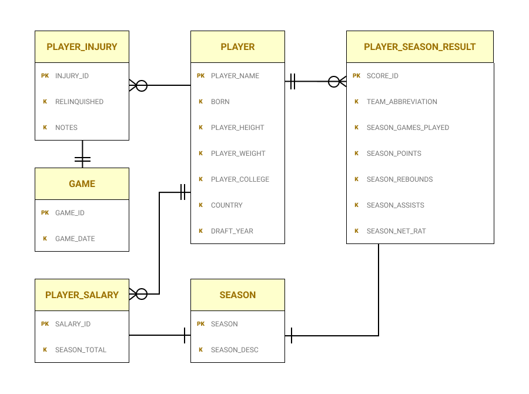
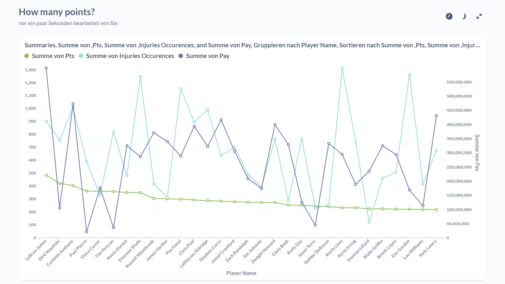

# Data analytics - Best players

## How to choose the best new NBA player to inquire

### What is this project about

This is not a typical GitHub code repository.

This project is divided in 2 parts, where:

- first part - entity relationship diagram (ERD) creation, database implementation, relational schema - creates PostgreSQL database in Docker environment, including the database normalization (up to 3N) and fills it with data from .csv files found on Internet,
- second part - analyzes the data, answers NBA trainer business questions and creates a report to visualize and summarise it.

This projects illustrates how to gather data, insert it into a database and
then extract the most relevant data to answer business relevant questions - a skill that we all need. This ability allows us to confront our subjective opinions with raw data.


This project tries to show and demonstrate how to answer typical client questions and solve problems using data in somewhat bigger quantities.
Something that a real analytics specialist encounters in his day to day job.

If you are still interested feel free to go through the steps below.
Draw your own conclusions and let me know if I could make it even better.

This project may be an example of first data analytics project.
If that's your goal, please, feel inspired to do something similar or do even more!

You can use my checklist from this repository:

> ./checklist.docx

to do so ;) It should help you create a similar project.

# Part 1 - Database creation

## a) Designing the Entity relationship diagram (ERD)

The first step included the creation of ERD, graphical representation of business relationships, lacking specific detail but providing an overview of scope. This diagram was created in Figma. (Shoutout to Figma devs!)



## b) Create database using PostgreSQL

I was thinking about using Google BigQuery or SQLite3 database, but finally I finally decided to use Postgres in Dockerized enviroment. I used following commands:

```
CREATE TABLE SEASONS ( SEASON date, SEASON_DESC text,
  PRIMARY KEY(SEASON)
);
CREATE TABLE GAMES (
  GAME_ID int GENERATED ALWAYS AS IDENTITY, GAME_DATE date,
  PRIMARY KEY(GAME_ID)
);
CREATE TABLE PLAYERS ( PLAYER_NAME text, BORN date, PLAYER_HEIGHT INT, PLAYER_WEIGHT INT, PLAYER_COLLEGE text, COUNTRY text, DRAFT_YEAR date,
  PRIMARY KEY(PLAYER_NAME)
);
CREATE TABLE PLAYER_INJURIES ( INJURY_ID INT GENERATED ALWAYS AS IDENTITY,  PLAYER_NAME text, GAME_ID INT NOT NULL, RELINQUISHED text, NOTES text,
  PRIMARY KEY(INJURY_ID),
CONSTRAINT fk_player FOREIGN KEY(PLAYER_NAME) REFERENCES players(PLAYER_NAME),
CONSTRAINT fk_game FOREIGN KEY(GAME_ID) REFERENCES games(GAME_ID)
);
CREATE TABLE PLAYER_SALARIES ( SALARY_ID INT GENERATED ALWAYS AS IDENTITY,   PLAYER_NAME text NOT NULL, SEASON_TOTAL INT, SEASON date NOT NULL, PRIMARY KEY(SALARY_ID),
CONSTRAINT fk_playername FOREIGN KEY(PLAYER_NAME) REFERENCES players(player_name),
CONSTRAINT fk_season FOREIGN KEY(SEASON) REFERENCES seasons(SEASON)
);
CREATE TABLE PLAYER_SEASON_RESULTS ( SCORE_ID INT GENERATED ALWAYS AS IDENTITY, PLAYER_NAME text NOT NULL, SEASON date, TEAM_ABBREVIATION text,SEASON_GAMES_PLAYED INT, SEASON_POINTS INT, SEASON_REBOUNDS INT, SEASON_ASSISTS INT, SEASON_NET_RAT INT,
PRIMARY KEY(SCORE_ID),
CONSTRAINT fk_playername FOREIGN KEY(PLAYER_NAME) REFERENCES players(player_name),
CONSTRAINT fk_season FOREIGN KEY(SEASON) REFERENCES seasons(SEASON)
);
```

The result was illustrated with UML diagram below:


## c) Get the data!!

Getting to the bone and finding relevant data may be difficult. There are many various ways to obtain it. F.e.: We can freely download data from official state sites like:

- [Statistisches Bundesamt](https://www.destatis.de/DE/Home/_inhalt.html),
- [Główny urząd statystyczny](https://stat.gov.pl/),
- [Stats NZ](https://stats.govt.nz/large-datasets/csv-files-for-download/),
- [Google Big Query Datasets](https://cloud.google.com/bigquery/)

I decided to use https://www.kaggle.com/ as the data provider, because it has a lot of free and reliable data (some of which may be old, be it should be enought for this demonstration project).

## d) Fill the database with your collected data

To create a Docker database and fill it with data from CSV use my docker-compose.yml (I'm assuming you have Docker installed on your system ^^ If not, try: [Docker intallation manual](https://docs.docker.com/engine/install/)).

Run:

```sh
$ docker-compose up -d
```

(remember to remove your containers with "docker-compose down --volumes" - otherwise the initialization will be skipped for relaunches)

This will create container with postgres database. Credentials:

> user: postgres

> pass: example

The database will be created automatically and filled with .csv files mentioned in create-tables.sql init file. Check the syntax yourself! Then you need to create the views either by logging in by adminer or by console. I personally used IntelliJ Data Tool. Create the views using my .sql scripts.

# Part 2 - Data analysis

## User scenario - Find the most valuable player

"I need a new player for my team, which should I choose?"

I tried to present my somewhat limited business intelligence of an NBA coach, trying to answer questions which would
help me buy new players to my team with best value for money ratio.

## 1) List out the important questions:

"I want a new player. Which one should I buy?"
"He should play on this position, ... this is my perspective"
"I am the owner of the club and i want it"

I could go and see a lot of NBA plays and get my own personal opinion
about different players and then choose the best one from my point of view.

Solid companies are based on data. Data is objective and not subjective,
and that's why business needs people who are able to make a fitting choice
based on collected data.

Before we even list out the important question we need to acknowledge what kind of data is available.

In NBA only specific kind of characteristics are measured and saved for each player. Those include not only physical attributes
but also different scoring systems.

To answer the question: "Which player will be the best choice?", I need to answer sub-questions.

Questions:

1. Which player scored the most points in last season? How many points each of them scored in the last season?
2. Which player had the least injuries in last season?
3. How much do those players cost? What is they price?

## 4) Visualize it

The questions are partially answered, the views are created - the "backend" is ready. It's time to prepare the "frontend" and visualize our results.

There are many different tools I could choose, including:

- [Tableau](https://www.tableau.com/)
- [Qlick Sense](https://www.qlik.com/)
- [Data Blocks](https://datablocks.pro/)
- [Power BI](https://powerbi.microsoft.com/en-au/)
- [Data Studio (mainly for GCP and BigQuery)](https://datastudio.google.com/)




This project took me 2-3 days, and was done mostly after my job, as extra work. ^^
Feel free to comment, collaborate or express your opinion!
This database could be remade to avoid repetitions and upgrade relations between them.
