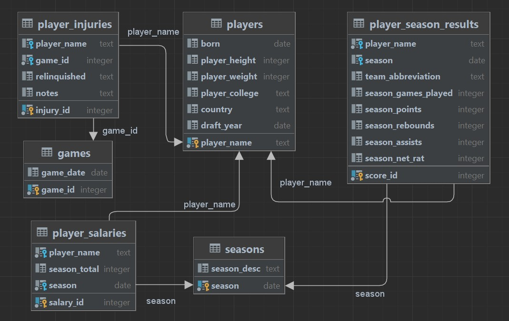

# Data analytics - Best players
## How to choose the best new NBA player to inquire

### What is this project about

This project tries to show and demonstrate how to answer typical client questions and solve problems using data in somewhat bigger quantities.
Something that a real analytics specialist encounters in his day to day job.  


This is not a typical GitHub code repository.

This projects illustrates how to gather data, insert it into a database and 
then extract the most relevant data to answer business relevant questions - a skill that we all need.
This ability allows us to confront our subjective opinions with raw data.

If you are still interested feel free to go through the steps below. 
Draw your own conclusions and let me know if I could make it even better.  

This project may be an example of first data analytics project.
If that's your goal, please, feel inspired to do something similar!

You can use my checklist 
>checklist.docx 
to do so ;) It should help you create a similar project.


# User scenario - Find the most valuable player

"I need a new player for my team, which should I choose?"

I tried to present my somewhat limited business intelligence of an NBA coach, trying to answer questions which would
help me buy new players to my team with best value for money ratio.

# 1) List out the important questions:

"I want a new player. Which one should I buy?"
"He should play on this position, ... this is my perspective"
"I am the owner of the club and i want it"

I could go and see a lot of NBA plays and get my own personal opinion
about different players and then choose the best one from my point of view.

Solid companies are based on data. Data is objective and not subjective, 
and that's why business needs people who are able to make a fitting choice 
based on collected data.

To answer the question: "Which player will be the best choice?", I need to answer sub-questions.

Questions:
1. Which player scored the most points in last season? How many points each of them scored in the last season?
2. Which player had the least injuries in last season?
3. How much do those players cost? What is they price?  


# 2) Get the data!

Getting to the bone may be sometimes difficult. Although we can freely download data from official state sites like:
- ["Statistisches Bundesamt"](https://www.destatis.de/DE/Home/_inhalt.html),
- ["Główny urząd statystyczny"](https://stat.gov.pl/),
- [Stats NZ](https://stats.govt.nz/large-datasets/csv-files-for-download/),
- [Google Big Query Datasets](https://cloud.google.com/bigquery/)


I decided to use https://www.kaggle.com/ as the data provider, because it has a lot of free and reliable data (some of which may be old, be it should be enought for this project).

# 3) Create database and fill it with your collected data

I was thinking about Google BigQuery, SQLite3, but I finally have chosen Postgres in Dockerized enviroment.

To create a Docker database and fill it with data from CSV use my docker-compose.yml 
(I'm assuming you have Docker installed on your system ^^ If not, and you use Windows system try: [https://docs.microsoft.com/en-us/windows/wsl/tutorials/wsl-containers](https://docs.microsoft.com/en-us/windows/wsl/tutorials/wsl-containers)).   
Run:  
```sh
$ docker-compose up -d 
```
(remember to remove it with "docker-compose down --volumes" - otherwise the initialization will be skipped)

This will create container with postgres database. Credentials:
> user: postgres  

> pass: example 

## UML ER Diagram
The ER Diagram (UML style) of DB looks like this:

  

The database will be created automatically and filled with .csv files mentioned in create-tables.sql init file. Check the syntax yourself! Then you need to create the views either by logging in by adminer or by console. I personally used IntelliJ Data Tool. Create the views using my .sql scripts.

# 4) Visualize it

The questions are partially answered, the views are created - the "backend" is ready. It's time to prepare the "frontend" and visualize our results.

There are many different tools I could choose, including:
- []() tableu
- []() clicksense
- []() data blicks
- []() powerbi
- []() data studio (for GCP and BigQuery)


